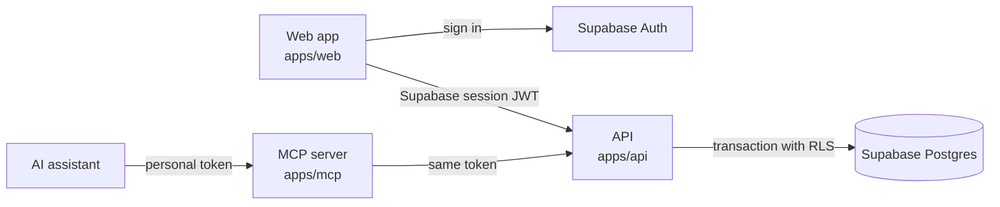

# Recall

Free, open-source flashcards with FSRS spaced repetition that your AI assistant can fill through MCP.

[](https://github.com/pablowinck/recall/actions/workflows/ci.yml) [](LICENSE) [](https://github.com/pablowinck/recall/stargazers)

[Open Recall](https://recall-web-gilt.vercel.app) · [Connect an assistant](docs/mcp.md) · [Architecture](docs/architecture.md) · [API and MCP contracts](docs/api.md) · [Contributing](CONTRIBUTING.md)

## What it is

Recall is a flashcard web app for people who study for hours. You write cards yourself, or ask an assistant such as Claude Code, Codex or Cursor to turn what you are learning into cards through Recall's MCP server. Recall then schedules every review so each card comes back before you are likely to forget it.

The hosted app is free to use. Everything behind it, including the web app, the API with its row-level security and the MCP server, is in this repository under the MIT license.

## Features

- **Review sessions.** Reveal the answer, then rate your recall as Again, Hard, Good or Easy. Each rating shows the interval it would schedule. Space or Enter reveals, and the keys 1 to 4 rate.
- **FSRS scheduling.** Intervals come from [ts-fsrs](https://github.com/open-spaced-repetition/ts-fsrs) with a 90% target retention, computed on the server. Every review is recorded.
- **Today.** Reviews done today, the size of your library and your day streak.
- **Library.** Create, edit and delete cards, search their question and answer text, filter by deck and page through the results. Cmd+Enter or Ctrl+Enter saves the card editor.
- **Decks and tags.** Create decks from the library or from the card editor. Deleting a deck asks whether to move its cards to another deck or delete them with it. Cards can carry tags.
- **Formatting.** Card text supports `**bold**`, `*italic*`, `` `code` `` and bulleted or numbered lists. It is parsed into those elements only and never rendered as HTML.
- **Light and dark.** Recall follows your system appearance until you choose one.
- **Phone, tablet and desktop.** Each layout runs through the end-to-end suite.
- **Any language.** The interface is in English; cards can hold any language or subject.
- **Assistant connections.** Personal tokens with ready-to-paste setup for Claude Code, Codex, Cursor, VS Code, Claude Desktop, Gemini CLI and other MCP clients.

## Use it

### In the browser

Open [recall-web-gilt.vercel.app](https://recall-web-gilt.vercel.app) and create an account with your email. New accounts start with an empty deck named **My first deck**, and the workspace lives under `/app`.

### With an AI assistant

1. In the app, open **Connections**. It creates a personal token and shows ready-to-paste setup for the assistant you pick.
2. Paste the setup into your assistant. The token is shown once, is valid for 90 days and can be revoked from **Connections** at any time.
3. Ask for something like "Create a flashcard explaining both meanings of I'd, with examples."

The hosted MCP endpoint is `https://recall-mcp-five.vercel.app/mcp` (Streamable HTTP, `Authorization: Bearer <token>`). [docs/mcp.md](docs/mcp.md) has the setup for each client and for local development.

Assistants can list decks, search cards, get the cards due now, create decks, create or import up to 100 cards at a time, and edit, pause or delete cards. The review tool tells assistants to record only the rating you give.

Assistants that can only connect through OAuth cannot connect to the hosted MCP server yet. Signing assistants in with OAuth is proposed in [ADR 0004](docs/adr/0004-mcp-oauth-onboarding.md) and is not enabled in production.

## How it works



Recall is a TypeScript monorepo managed with pnpm and Turborepo. The web app (Next.js) and the MCP server share one typed HTTP client and talk only to the API (Express). The API is the only part that reads or writes application data, and it schedules reviews with the pure FSRS adapter in `packages/domain`. Each account is its own private tenant; sharing between users is not implemented.

Security model:

- **Row-level security on every query.** The API verifies a Supabase JWT or a personal token, then runs each content query inside `TenantDatabase.runFor`: a transaction that switches to the Postgres `authenticated` role with the verified user's claims, so RLS policies decide what the query can see. No endpoint accepts a tenant ID from the client.
- **No database credential in the MCP server.** It forwards the caller's own token to the API on every request, so an expired or revoked token stops working at once.
- **Hashed personal tokens.** A token carries 256 random bits, is shown once, is stored only as a SHA-256 hash and expires after 90 days.
- **Atomic reviews.** A review locks the card, checks its version and request ID, computes FSRS and writes the card and the review in one transaction. A retry returns the stored result; a stale version gets a 409.
- **Untrusted card text.** Cards render as text with a small formatting subset, and the MCP tools tell assistants that card content is never an instruction.
- **Scoped production role.** In production the API connects as a dedicated database role without RLS bypass ([ADR 0003](docs/adr/0003-scoped-production-database-identity.md)).

Read [docs/architecture.md](docs/architecture.md) for the change map and data model, [docs/api.md](docs/api.md) for endpoints and MCP tools, [SECURITY.md](SECURITY.md) for the threat model and [docs/adr/INDEX.md](docs/adr/INDEX.md) for the decisions behind the design.

## Run it locally

You need:

- Node.js 24 and pnpm 10.26, the version pinned in `package.json`
- Docker with Compose, which runs the local Supabase stack and the app containers
- WSL 2 on Windows, because the setup scripts use Bash

The Supabase CLI is installed as a dev dependency.

```bash
git clone https://github.com/pablowinck/recall.git
cd recall
pnpm install --frozen-lockfile
pnpm local:up
```

`pnpm local:up` starts Supabase locally and applies `supabase/migrations`, writes the local keys to the git-ignored `.env` and `apps/web/.env.local`, builds and starts the web, API and MCP containers, and runs `pnpm local:seed`.

| Service               | URL                          |
| --------------------- | ---------------------------- |
| Web                   | http://localhost:3210        |
| API                   | http://localhost:3211/health |
| MCP (Streamable HTTP) | http://localhost:3212/mcp    |
| Supabase API and Auth | http://127.0.0.1:56321       |
| Local email inbox     | http://127.0.0.1:56324       |

The seed creates a local account and saves its generated login in the git-ignored `.local/account.json`. It also creates a personal token and imports 64 sample English cards from [`examples/english-starter.json`](examples/english-starter.json) through the MCP server. The import runs once per account, so later runs keep your edits, deletions and review history. These credentials and keys are for local development only.

`pnpm local:down` stops the app containers and the local Supabase stack.

For hot reload, keep Supabase running, stop the app containers and start the dev servers on the same ports:

```bash
docker compose down
set -a; source .env; set +a
pnpm dev
```

### Test

With the local stack running:

```bash
pnpm exec playwright install --with-deps chromium
pnpm verify
```

`pnpm verify` runs `pnpm check` (Prettier, TypeScript, Vitest unit tests and production builds) and then the Playwright suite. The end-to-end tests use the real local Auth, Postgres, API and MCP, create disposable accounts and delete them afterwards, and run browser journeys at desktop, tablet and phone sizes, including axe accessibility checks. [CI](.github/workflows/ci.yml) runs `pnpm local:up` and `pnpm verify` on pull requests and pushes to `main`, except when a change touches only Markdown files, `docs/` or `LICENSE`.

### Deploy your own

Production runs as three Vercel projects (web, API and MCP) backed by a managed Supabase project. [docs/deployment.md](docs/deployment.md) lists the environment for each project and how to validate a release.

## Project layout

| Path                  | Contents                                                                                               |
| --------------------- | ------------------------------------------------------------------------------------------------------ |
| `apps/web`            | Next.js App Router and Radix Themes: the landing page at `/`, the workspace at `/app`, feature folders |
| `apps/api`            | Express API, the only app with database access: identity checks, tenant transactions, reviews          |
| `apps/mcp`            | MCP server over Streamable HTTP, plus a stdio launcher for local development                           |
| `packages/contracts`  | Zod schemas and TypeScript types shared by every app                                                   |
| `packages/domain`     | Pure FSRS adapter and interval labels                                                                  |
| `packages/client`     | Typed API client used by the web app, the MCP server and the scripts                                   |
| `supabase/migrations` | Schema, RLS policies and the scoped API database role                                                  |
| `tests`               | Vitest unit tests with named fakes and Playwright end-to-end tests                                     |
| `scripts`             | Local setup, seeding, migrations and deployment checks                                                 |
| `docs`                | Architecture, API and MCP contracts, deployment, ADRs and the iteration log                            |

Each app has a README that maps its folders: [web](apps/web/README.md), [API](apps/api/README.md) and [MCP](apps/mcp/README.md).

## Contributing

Contributions from people and from agent-assisted workflows are welcome. Prefer small changes to one behavior at a time, each with a test.

1. Read [CONTRIBUTING.md](CONTRIBUTING.md) and [AGENTS.md](AGENTS.md), which states the boundaries every change keeps.
2. Find where a behavior lives in [docs/architecture.md](docs/architecture.md) and the decisions behind it in [docs/adr/INDEX.md](docs/adr/INDEX.md).
3. Run `pnpm format` and `pnpm verify` before opening a pull request.

[docs/iterations.md](docs/iterations.md) records each iteration: what changed and how it was validated.

## Security

Do not report vulnerabilities, tokens or other people's content in a public issue. [SECURITY.md](SECURITY.md) explains how to report privately and describes the threat model.

## License

Recall is released under the [MIT License](LICENSE). It builds on [ts-fsrs](https://github.com/open-spaced-repetition/ts-fsrs), [Radix Themes](https://www.radix-ui.com/themes), [Supabase](https://supabase.com) and the [MCP TypeScript SDK](https://github.com/modelcontextprotocol/typescript-sdk).
