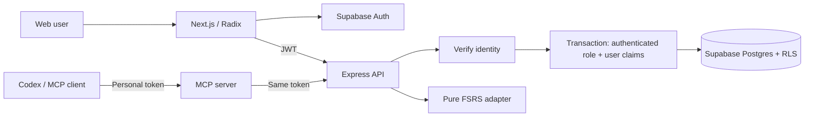

# Architecture map

## Request flow

The web and MCP apps share HTTP contracts. Only the API accesses application data. A personal tenant's ID is the Supabase user ID. Sharing between users is intentionally not implemented; a future membership model requires an explicit migration and ADR.

## Where to change a behavior

| Behavior                     | First file or directory                                                                                                      |
| ---------------------------- | ---------------------------------------------------------------------------------------------------------------------------- |
| Card input validation        | `packages/contracts/src/index.ts`                                                                                            |
| FSRS rules / interval labels | `packages/domain/src/`                                                                                                       |
| Login/session                | `apps/web/src/features/auth/`, `apps/web/src/lib/use-recall-session.ts`                                                      |
| Card editor or library       | `apps/web/src/features/cards/`                                                                                               |
| Study interactions           | `apps/web/src/features/study/`                                                                                               |
| A feature's styles           | `apps/web/src/features/<feature>/<feature>.css`                                                                              |
| Landing page, SEO metadata   | `apps/web/src/features/marketing/`, `apps/web/src/app/page.tsx`, `apps/web/src/app/robots.ts`, `apps/web/src/app/sitemap.ts` |
| Workspace addresses and Back | `apps/web/src/features/workspace/workspace-url.ts`, `apps/web/src/features/workspace/use-workspace-history.ts`               |
| Assistant OAuth consent      | `apps/web/src/features/auth/oauth-consent-screen.tsx`, `apps/web/src/app/oauth/consent/page.tsx`                             |
| MCP OAuth discovery          | `apps/mcp/src/protected-resource.ts`, ADR 0004                                                                               |
| Design tokens / base styles  | `apps/web/src/styles/`, imported in order by `app/globals.css`                                                               |
| Shared HTTP calls            | `packages/client/src/index.ts`                                                                                               |
| HTTP endpoint for a feature  | `apps/api/src/<feature>/<feature>-routes.ts` + `<feature>-store.ts`                                                          |
| Route composition / identity | `apps/api/src/http/routes.ts`, `apps/api/src/http/tenant-route.ts`                                                           |
| Tenant boundary              | `apps/api/src/database.ts`, `supabase/migrations/`                                                                           |
| Review transaction           | `apps/api/src/reviews/review-store.ts`                                                                                       |
| MCP tools                    | `apps/mcp/src/tools.ts`                                                                                                      |
| Containers                   | `Dockerfile`, `compose.yaml`                                                                                                 |

## Data and concurrency

`tenants` own `decks`, `cards`, `reviews` and `access_tokens`. Composite deck/tenant and card/tenant foreign keys prevent attaching cards or reviews to another user's content. All query parameters are bound SQL values. Tables are outside the Supabase Data API's exposed schemas.

A review locks the current card row, checks for an existing request ID, verifies the caller's expected version, computes FSRS on the server, updates the card and inserts the review in one transaction. Repeated requests return the stored result. Competing evaluations with stale versions return 409.

MCP source keys are unique within a tenant. Re-importing the starter data returns existing cards without replacing their content or scheduling history.

## Tradeoffs

- Direct SQL keeps transactions explicit and avoids another ORM layer. Queries stay in focused stores, behind the tenant transaction boundary.
- FSRS has fixed 90% target retention initially. Per-user scheduling preferences are a later change, not a hidden setting.
- Study history day boundaries currently use America/Sao_Paulo. Per-user time zones need an explicit preference before international rollout.
- Docker starts the production builds for parity. Hot reload is available separately via `pnpm dev`.
- Static bearer tokens are supported for MCP. OAuth discovery/consent is not implemented yet.

See [ADR 0002](adr/0002-typescript-monorepo-and-personal-tenants.md) for the durable decision and its status.
